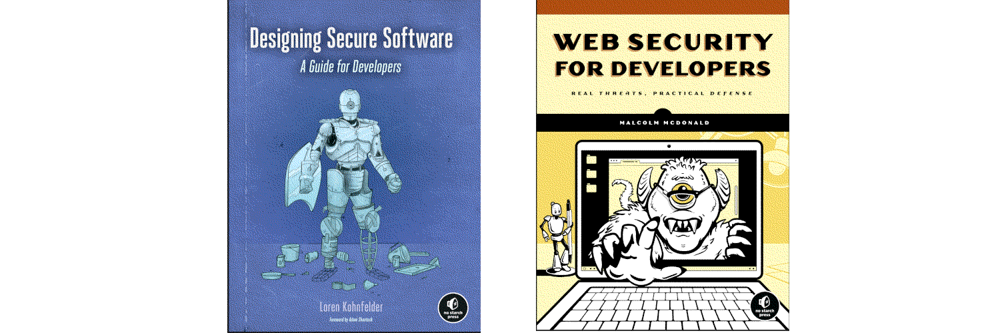

Shift left web applications
===================================================

The process of designing and reviewing a software design with security considerations in mind.

----

----

.. toctree::
   :glob:
   :maxdepth: 1
   :includehidden:
   :caption: Lockdown environment

   docs/lockdown/README.md
   docs/lockdown/*

.. toctree::
   :glob:
   :maxdepth: 1
   :includehidden:
   :caption: Coding

   docs/coding/README.md
   docs/coding/*

.. toctree::
   :glob:
   :maxdepth: 1
   :includehidden:
   :caption: Libraries and frameworks

   docs/libraries/README.md
   docs/libraries/*

.. toctree::
   :glob:
   :maxdepth: 1
   :includehidden:
   :caption: Protocols

   docs/protocols/README.md
   docs/protocols/*

.. toctree::
   :glob:
   :maxdepth: 1
   :includehidden:
   :caption: Databases

   docs/databases/README.md
   docs/databases/*

.. toctree::
   :maxdepth: 1
   :includehidden:
   :caption: API

   docs/api/README.md
   docs/api/monitor.md
   docs/api/scan.md
   docs/api/notrust.md
   docs/api/tools.md

.. toctree::
   :glob:
   :maxdepth: 1
   :includehidden:
   :caption: Security testing

   docs/testing/README.md
   docs/testing/*

.. toctree::
   :caption: Links

   Blue Team <https://blue.tymyrddin.dev/>
